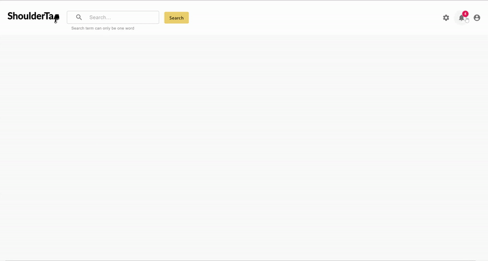

# Word Cloud
**Word Cloud** creates a word cloud of of related words given a search term from the user.

## Functionality

The following **required** functionality is completed:

* [x] Ability to query the Words API to get HasType results from a search query
* [x] The search results are displayed in a React Wordcloud
* [x] Verification that a single word is passed into the search query

The following **extensions** are implemented:

* [x] Responsive UI that minimizes/shows icons in the toolbar depending on window size
* [x] Word enlarges on hover and becomes bold when selected

## Video Walkthrough

Here's a walkthrough of implemented user stories:

